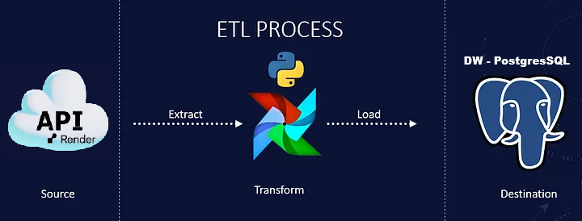
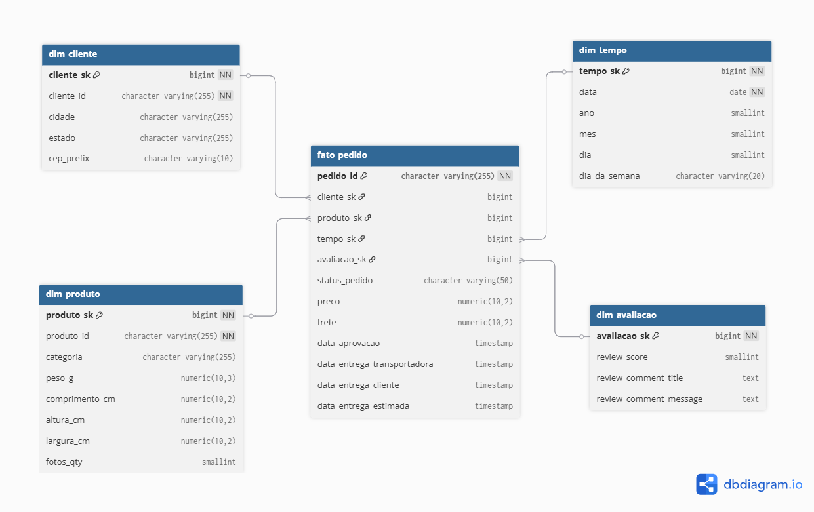

# 📊 Desafio Técnico Maxinutri - Engenheiro de Dados

## 📋 Visão Geral

Solução completa de ETL para processamento de dados de e-commerce, implementando um Data Warehouse dimensional com PostgreSQL e orquestração via Apache Airflow. Este projeto processa dados de uma API de e-commerce, realiza transformações e carrega em um modelo dimensional otimizado para análise.

## 🏗️ Arquitetura do Sistema
A arquitetura é composta por:
1. **Fonte de Dados**: API RESTful paginada com dados de clientes, produtos e pedidos.
2. **Data Lake**: Armazenamento bruto dos dados extraídos em formatos Parquet e CSV.
3. **ETL Pipeline**: Orquestrado pelo Apache Airflow, dividido em três
    etapas principais:
    - **Extração**: Coleta de dados da API com tratamento de paginação e erros.
    - **Transformação**: Limpeza, validação e enriquecimento dos dados.
    - **Carga**: Inserção eficiente no Data Warehouse PostgreSQL.
4. **Data Warehouse**: Modelo dimensional em PostgreSQL com tabelas de fato e dimensão.
5. **Monitoramento**: Logs estruturados e sistema de alertas por email para falhas e métricas de performance.



## 🛠️ Tecnologias Utilizadas

- **Linguagem**: Python 3.9+
- **Banco de Dados**: PostgreSQL 13+
- **Orquestração**: Apache Airflow 2.5+
- **Formato de Dados**: Parquet, CSV
- **Ferramentas**: Docker, Pandas, Psycopg2, Requests
- **Monitoramento**: Logging estruturado, Alertas por email

## 📊 Modelagem Dimensional

### Schema Estrela Implementado

**Tabelas de Dimensão:**
- `dim_cliente` - Informações dos clientes (cidade, estado, CEP)
- `dim_produto` - Detalhes dos produtos (categoria, dimensões, peso)  
- `dim_tempo` - Dimensão temporal (data, ano, mês, dia, trimestre)
- `dim_avaliacao` - Avaliações e reviews (score, comentários)

**Tabela de Fato:**
- `fato_pedido` - Métricas e fatos dos pedidos (preço, frete, status, datas)



### 🤔 Por que Modelo Estrela?

Escolhi o modelo estrela porque:
1. **Simplicidade**: Mais fácil de entender e consultar para usuários de negócio
2. **Performance**: Menos joins necessários para queries analíticas
3. **Manutenção**: Mais simples de manter e evoluir
4. **Escalabilidade**: Adequado para crescimento gradual de dados
5. **Compatibilidade**: Melhor integração com ferramentas BI


## ⚙️ Configuração e Instalação

### Pré-requisitos

```bash
# Clone o repositório
git clone https://github.com/nandodevs/desafio-engenheiro-dados.git
cd desafio-engenheiro-dados

# Instalar dependências
pip install -r requirements.txt

# Configurar variáveis de ambiente
cp .env.example .env
```

### Configuração do Ambiente

Edite o arquivo `.env` com suas configurações:

```env
# API Configuration
API_URL=https://teste-engenheiro.onrender.com
TOKEN="sua chave token"

# Adicione as configurações do banco Postgres no airflow_settings.yaml
POSTGRES_HOST=localhost
POSTGRES_PORT=5432
POSTGRES_DB=desafio_db
POSTGRES_USER=airflow
POSTGRES_PASSWORD=airflow

# Email Alerts (opcional)
EMAIL_HOST=smtp.gmail.com
EMAIL_PORT=587
EMAIL_USER=seu-email@gmail.com
EMAIL_PASSWORD=sua-senha
```
Renomeio o arquivo ".env.example para .env" e adicione as variávies necessárias:

```env
# Configurações da API
TOKEN = "token da api"
API_URL = "https://teste-engenheiro.onrender.com/data"

# Configurações do Airflow
AIRFLOW__CORE__LOAD_EXAMPLES=False
AIRFLOW__WEBSERVER__EXPOSE_CONFIG=True

# Configurações de Email (opcional)
SMTP_HOST=smtp.gmail.com
SMTP_PORT=587
SMTP_USER=seuemail@gmail.com
SMTP_PASSWORD=codigoapp

# Email que enviará os alertas (pode ser o mesmo ou diferente)
SMTP_MAIL_FROM=seuemail@gmail.com

# Lista de emails que receberão os alertas (separados por vírgula)
ALERT_RECIPIENTS=email-destinatario@gmail.com

# Email específico para falhas críticas
CRITICAL_ALERTS=email-destinatario@gmail.com
```


Instale o Astro CLI no seu computador (Windows):

```bash
winget install -e --id Astronomer.Astro
```

- Execute os comandos abaixo dentro da pasta do projeto:
```bash
# Iniciar a estrutura de pastas e arquivos necessários
astro dev init

#Criar os container Docker e abre a navegador com o Airflow
astro dev start
```

## 🔧 Estrutura do Projeto

```
projeto-desafio/
├── dags/                    # DAGs do Airflow
│   └── etl_dag.py          # DAG principal do ETL
├── etl/                     # Scripts ETL
│   ├── extract.py          # Extração de dados da API
│   ├── transform.py        # Transformação e limpeza
│   ├── load.py             # Carga no PostgreSQL
│   └── monitoring.py       # Sistema de alertas
├── sql/                     # Schema e queries
│   └── schema.sql          # Schema completo do DW
├── data/                    # Camada do data lake
│   ├── raw/                # Dados brutos da API
│   └── processed/          # Dados tratados
├── tests/                   # Testes automatizados
│   ├── test_extract.py
│   ├── test_transform.py
│   └── test_load.py  
├── scripts/                 # Scripts auxiliares
│   └── validate_new_data.py # Validação de novos dados
└── docs/                    # Documentação
    └── architecture.md     # Diagramas de arquitetura
    Dockerfile              # Configurações Docker
    docker-compose.yml       
```

## 🎯 Funcionalidades Implementadas

### ✅ Extração Resiliente
- Paginação automática da API com retry mechanism
- Timeout configurável e backoff exponencial
- Salvamento em múltiplos formatos (Parquet + CSV)
- Tratamento de erros com retry (5 tentativas)

### ✅ Transformação Robusta
- Inferência automática de tipos de dados
- Limpeza abrangente e validação de qualidade
- Otimização de memória com tipos específicos
- Relatório detalhado de qualidade dos dados

### ✅ Carga Eficiente
- Inserção em lote com controle transacional
- Upsert inteligente com conflic handling
- Logging detalhado de performance
- Validação de integridade referencial

### ✅ Monitoramento e Alertas
- Logs estruturados com diferentes níveis
- Sistema de alertas por email configurável
- Métricas de performance do ETL
- Validação pós-carga automática

## 🧪 Validação de Dados:

### Validação de Dados:
- Verificação de integridade referencial entre dimensões e fatos
- Validação de ranges para valores numéricos
- Consistência temporal e validade de datas
- Completeness check para campos obrigatórios

## 🔮 Próximas Melhorias
### Longo-prazo (3-6 meses):
- [ ] Streaming pipeline com Kafka/Spark Streaming
- [ ] Migração para cloud (BigQuery/Snowflake + Airflow Cloud)
- [ ] Real-time dashboards com Metabase/Grafana
- [ ] Integração com modelos de Machine Learning
- [ ] Sistema de data quality monitoring contínuo

## Descrição detalhada das etapas do ETL

### Extract
- Consome a API paginada (`/data?token=...&page=N`).
- Implementa retries exponenciais com `tenacity` (parâmetros: up to 5 tentativas, backoff exponencial com máximo de 60s).
- Persiste cada página como `data/raw/page_N.json` e grava `_meta.json` com informação de paginação e contagens.
- Em caso de erro irreversível (status não 200 após retries), a task falha e o erro é logado com stacktrace.

### Explore / Profiling
- Consolida todos os objetos `dados` das páginas em um DataFrame (pandas).
- Gera `reports/profile.md` contendo: linhas, colunas, nulos por coluna, distinct, e amostras de valores.
- Escreve `data/processed/records.csv` para uso da etapa de transformação.

### Transform
- Lê `data/processed/records.csv` (ou consolida direto dos JSONs se CSV não existir).
- Converte colunas de data (`*_timestamp`, `*_at`, `date*`) para datetime (`pandas.to_datetime` com `errors='coerce'`).
- Converte colunas numéricas (ex.: `price`, `freight_value`, `product_weight_g`, dimensões do produto) para numérico com `pd.to_numeric(..., errors='coerce')`.
- Executa validações sobre os dados (antes do load):
  - Checagem de valores nulos em colunas críticas (`order_id`, `customer_id`, `order_purchase_timestamp`).
  - Checagem de duplicados em `order_id` (ou chave candidata definida).
  - Checagem de datas inválidas (linhas com `NaT` após parsing).
- Se houver problemas de validação, a etapa levanta `ValueError` e salva `reports/validation_report.txt` com detalhes. O pipeline encerra nesse ponto (evita ingestão de dados sujos).

### Load (PostgreSQL)
- Conecta ao Postgres usando SQLAlchemy/psycopg2.
- Cria schema/tabelas (se necessário) e carrega os dados validados em `fato_pedido` (nomeada conforme o case) com `df.to_sql(..., if_exists='replace' ou 'append')` — a estratégia usada no projeto pode ser configurada (full replace para entrega, incremental em produção).
- Opcional: cria/atualiza `dim_tempo` a partir da primeira coluna de data encontrada (upsert simples).

---

## Tratamento de erros & Logs
- Retries/backoff: extração usa `tenacity` para proteger contra falhas temporárias da API. Logs mostram tentativas e backoff aplicados.
- Validações explícitas: transform valida e interrompe o pipeline com relatório em `reports/validation_report.txt` sempre que encontra problemas críticos.
- Logs: recomenda-se usar `logging` do Python com configuração por variável `LOG_LEVEL`. Logs por padrão podem ser configurados para gravar em `logs/etl.log`. No Airflow, cada task possui sua própria saída de log no UI e discos montados.
- Erro no Airflow: qualquer exceção não capturada faz a task falhar e o Airflow registra o traceback completo. Use retries do Airflow (configuráveis no DAG) para falhas transitórias também.

---

## Schema do Data Warehouse (exemplo baseado no projeto)
A imagem do banco está em `docs/imgs/schema_visual_db.png` (fornecida) e o diagrama ETL está em `docs/imgs/etl_flow.png` (gerado). Tabelas principais esperadas no DW:

- dim_cliente (cliente_id, nome, cidade, estado, zip_prefix, ...)
- dim_produto (product_id, nome_categoria, peso_g, comprimento_cm, altura_cm, largura_cm, ...)
- dim_avaliacao (review_id, review_score, comment, created_at, answered_at, ...)
- dim_tempo (date_key, year, month, day, weekday)
- fato_pedido (order_id, customer_id -> dim_cliente, product_id -> dim_produto, order_status, price, freight_value, order_purchase_timestamp -> dim_tempo_key, ...)

Exemplo simples de criação (em `sql/schema.sql`):
```sql
CREATE TABLE IF NOT EXISTS public.dim_cliente (
  customer_id TEXT PRIMARY KEY,
  customer_city TEXT,
  customer_state TEXT,
  customer_zip_code_prefix INT
);

CREATE TABLE IF NOT EXISTS public.dim_produto (
  product_id TEXT PRIMARY KEY,
  product_category_name TEXT,
  product_weight_g INT,
  product_length_cm INT,
  product_height_cm INT,
  product_width_cm INT
);

CREATE TABLE IF NOT EXISTS public.dim_tempo (
  date_key DATE PRIMARY KEY,
  year INT,
  month INT,
  day INT,
  weekday INT
);

CREATE TABLE IF NOT EXISTS public.fato_pedido (
  order_id TEXT PRIMARY KEY,
  customer_id TEXT,
  product_id TEXT,
  order_status TEXT,
  order_purchase_timestamp TIMESTAMP,
  price NUMERIC,
  freight_value NUMERIC
);
```

---

## Observabilidade e testes
- Relatórios: `reports/profile.md` (profiling inicial) e `reports/validation_report.txt` (falhas de validação).
- Testes unitários: recomenda-se adicionar testes para as funções de parsing/validação (ex.: `tests/etl/test_transform.py`).
- Checks: contagens por etapa (raw rows vs loaded rows) e checksums podem ser adicionados a uma tabela de metadata para auditoria.

---

## 🙋‍♂️ FAQ

**Q: Por que não usar Kafka para ingestão?**
**R:** Para este volume de dados (API paginada com ~1000 registros), uma solução batch é mais simples e adequada. Kafka seria overengineering e adicionaria complexidade desnecessária.

**Q: Por que Python e não Spark?**
**R:** Python + Pandas é suficiente para este volume de dados e mais simples de manter. Spark seria necessário apenas para volumes > 10GB ou processamento streaming.

**Q: Como lidar com dados incrementais?**
**R:** A DAG é projetada para processamento incremental usando timestamps dos registros. O sistema verifica a última data processada e só busca dados novos.

**Q: Qual a estratégia de tratamento de erros?**
**R:** Implementamos retry com backoff exponencial, logging estruturado, alertas por email e transações atômicas para garantir consistência.

**Q: Como escalar este projeto?**
**R:** A arquitetura permite escalar horizontalmente com: particionamento de tabelas, processamento distribuído com Spark, e migração para cloud.

---

## 🎯 Conclusão

Esta solução demonstra habilidades completas em engenharia de dados, desde ingestão de APIs até modelagem dimensional e automação com Airflow. A arquitetura é robusta, escalável e mantém simplicidade onde possível, seguindo as melhores práticas do mercado.

**Diferenciais Implementados:**
- ✅ Documentação completa e detalhada
- ✅ Tratamento de erros robusto com retry mechanism
- ✅ Modelagem dimensional bem fundamentada
- ✅ Automatização completa com Apache Airflow
- ✅ Otimizações de performance e uso de memória
- ✅ Sistema de monitoramento e alertas
- ✅ Testes automatizados e validação de dados
- ✅ Preparação para escalabilidade futura

---

*Este projeto foi desenvolvido como parte do processo seletivo para Engenheiro de Dados. Para dúvidas ou mais informações, entre em contato através do GitHub.*