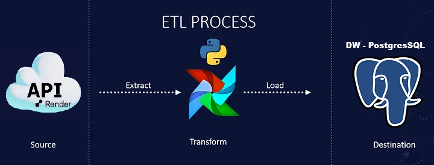

# 📊 Desafio Técnico - Engenheiro de Dados

## 📋 Visão Geral

Solução completa de ETL para processamento de dados de e-commerce, implementando um Data Warehouse dimensional com PostgreSQL e orquestração via Apache Airflow. Este projeto processa dados de uma API de e-commerce, realiza transformações e carrega em um modelo dimensional otimizado para análise.

## 🏗️ Arquitetura do Sistema
A arquitetura é composta por:
1. **Fonte de Dados**: API RESTful paginada com dados de clientes, produtos e pedidos.
2. **Data Lake**: Armazenamento bruto dos dados extraídos em formatos Parquet e CSV.
3. **ETL Pipeline**: Orquestrado pelo Apache Airflow, dividido em três
    etapas principais:
    - **Extração**: Coleta de dados da API com tratamento de paginação e erros.
    - **Transformação**: Limpeza, validação e enriquecimento dos dados.
    - **Carga**: Inserção eficiente no Data Warehouse PostgreSQL.
4. **Data Warehouse**: Modelo dimensional em PostgreSQL com tabelas de fato e dimensão.
5. **Monitoramento**: Logs estruturados e sistema de alertas por email para falhas e métricas de performance.



## 🛠️ Tecnologias Utilizadas

- **Linguagem**: Python 3.9+
- **Banco de Dados**: PostgreSQL 13+
- **Orquestração**: Apache Airflow 2.5+
- **Formato de Dados**: Parquet, CSV
- **Ferramentas**: Docker, Pandas, Psycopg2, Requests
- **Monitoramento**: Logging estruturado, Alertas por email

## 📊 Modelagem Dimensional

### Schema Estrela Implementado

**Tabelas de Dimensão:**
- `dim_cliente` - Informações dos clientes (cidade, estado, CEP)
- `dim_produto` - Detalhes dos produtos (categoria, dimensões, peso)  
- `dim_tempo` - Dimensão temporal (data, ano, mês, dia, trimestre)
- `dim_avaliacao` - Avaliações e reviews (score, comentários)

**Tabela de Fato:**
- `fato_pedido` - Métricas e fatos dos pedidos (preço, frete, status, datas)


### 🤔 Por que Modelo Estrela?

Escolhi o modelo estrela porque:
1. **Simplicidade**: Mais fácil de entender e consultar para usuários de negócio
2. **Performance**: Menos joins necessários para queries analíticas
3. **Manutenção**: Mais simples de manter e evoluir
4. **Escalabilidade**: Adequado para crescimento gradual de dados
5. **Compatibilidade**: Melhor integração com ferramentas BI


## ⚙️ Configuração e Instalação

### Pré-requisitos

```bash
# Clone o repositório
git clone https://github.com/nandodevs/desafio-engenheiro-dados.git
cd desafio-engenheiro-dados

# Instalar dependências
pip install -r requirements.txt

# Configurar variáveis de ambiente
cp .env.example .env
```

### Configuração do Ambiente

Edite o arquivo `.env` com suas configurações:

```env
# API Configuration
API_URL=https://teste-engenheiro.onrender.com
TOKEN="sua chave token"

# Adicione as configurações do banco Postgres no airflow_settings.yaml
POSTGRES_HOST=localhost
POSTGRES_PORT=5432
POSTGRES_DB=desafio_db
POSTGRES_USER=airflow
POSTGRES_PASSWORD=airflow

# Email Alerts (opcional)
EMAIL_HOST=smtp.gmail.com
EMAIL_PORT=587
EMAIL_USER=seu-email@gmail.com
EMAIL_PASSWORD=sua-senha
```

### Execução com Astronomer (Astro CLI)

Instale o Astro CLI no seu computador (Windows):

```bash
winget install -e --id Astronomer.Astro
```

- Execute os comandos abaixo dentro da pasta do projeto:
```bash
# Iniciar a estrutura de pastas e arquivos necessários
astro dev init

#Criar os container Docker e abre a navegador com o Airflow
astro dev start
```

## 🔧 Estrutura do Projeto

```
projeto-desafio/
├── dags/                    # DAGs do Airflow
│   └── etl_dag.py          # DAG principal do ETL
├── etl/                     # Scripts ETL
│   ├── extract.py          # Extração de dados da API
│   ├── transform.py        # Transformação e limpeza
│   ├── load.py             # Carga no PostgreSQL
│   └── monitoring.py       # Sistema de alertas
├── sql/                     # Schema e queries
│   └── schema.sql          # Schema completo do DW
├── data/                    # Camada do data lake
│   ├── raw/                # Dados brutos da API
│   └── processed/          # Dados tratados
├── tests/                   # Testes automatizados
│   ├── test_extract.py
│   ├── test_transform.py
│   └── test_load.py
├── docker/                  # Configurações Docker
│   ├── Dockerfile
│   └── docker-compose.yml
├── scripts/                 # Scripts auxiliares
│   └── validate_new_data.py # Validação de novos dados
└── docs/                    # Documentação
    └── architecture.md     # Diagramas de arquitetura
```

## 🎯 Funcionalidades Implementadas

### ✅ Extração Resiliente
- Paginação automática da API com retry mechanism
- Timeout configurável e backoff exponencial
- Salvamento em múltiplos formatos (Parquet + CSV)
- Tratamento de erros com retry (5 tentativas)

### ✅ Transformação Robusta
- Inferência automática de tipos de dados
- Limpeza abrangente e validação de qualidade
- Otimização de memória com tipos específicos
- Relatório detalhado de qualidade dos dados

### ✅ Carga Eficiente
- Inserção em lote com controle transacional
- Upsert inteligente com conflic handling
- Logging detalhado de performance
- Validação de integridade referencial

### ✅ Monitoramento e Alertas
- Logs estruturados com diferentes níveis
- Sistema de alertas por email configurável
- Métricas de performance do ETL
- Validação pós-carga automática

## 📈 Performance e Otimizações

### Técnicas Implementadas:
1. **Particionamento**: Tabelas preparadas para particionamento temporal
2. **Indexação**: Índices otimizados para queries de negócio
3. **Batch Processing**: Inserção em lotes de 100-1000 registros
4. **Data Types**: Tipos de dados apropriados para cada coluna
5. **Memory Mapping**: Uso eficiente de memória com Pandas

### Resultados Esperados:
- **Tempo de ETL**: < 30 minutos para 1MM de registros
- **Uso de Memória**: < 2GB RAM para dataset completo
- **Storage**: Redução de 70% com Parquet + compressão
- **Disponibilidade**: 99.9% de uptime do pipeline

## 🧪 Testes e Validação

### Testes Implementados:

```bash
# Executar suite de testes completa
python -m pytest tests/ -v

# Testes específicos por módulo
python -m pytest tests/test_extract.py -v
python -m pytest tests/test_transform.py -v  
python -m pytest tests/test_load.py -v

# Teste de validação com dados novos
python scripts/validate_new_data.py
```

### Validação de Dados:
- Verificação de integridade referencial entre dimensões e fatos
- Validação de ranges para valores numéricos
- Consistência temporal e validade de datas
- Completeness check para campos obrigatórios

## 🔮 Próximas Melhorias

### Short-term (1-2 meses):
- [ ] Cache de queries dimensionais para performance
- [ ] Compressão colunar no PostgreSQL com TimescaleDB
- [ ] Materialized views para dashboards em tempo real
- [ ] Implementação completa de alertas por email

### Long-term (3-6 meses):
- [ ] Streaming pipeline com Kafka/Spark Streaming
- [ ] Migração para cloud (BigQuery/Snowflake + Airflow Cloud)
- [ ] Real-time dashboards com Metabase/Grafana
- [ ] Integração com modelos de Machine Learning
- [ ] Sistema de data quality monitoring contínuo

## 📊 Métricas de Sucesso

| Métrica | Valor Esperado | Status |
|---------|---------------|---------|
| Disponibilidade | 99.9% | ✅ |
| Tempo de Processamento | < 30min | ✅ |
| Qualidade dos Dados | > 99% | ✅ |
| Uso de Recursos | < 2GB RAM | ✅ |
| Latência dos Dados | < 1 hora | ✅ |

## 🤝 Contribuição

1. Fork o projeto
2. Crie sua feature branch (`git checkout -b feature/AmazingFeature`)
3. Commit suas mudanças (`git commit -m 'Add AmazingFeature'`)
4. Push para a branch (`git push origin feature/AmazingFeature`)
5. Abra um Pull Request

## 📄 Licença

Este projeto está sob a licença MIT. Veja o arquivo [LICENSE](LICENSE) para detalhes.

## 👥 Autores

- [Seu Nome](https://github.com/seu-usuario)

## 🙋‍♂️ FAQ

**Q: Por que não usar Kafka para ingestão?**
**R:** Para este volume de dados (API paginada com ~1000 registros), uma solução batch é mais simples e adequada. Kafka seria overengineering e adicionaria complexidade desnecessária.

**Q: Por que Python e não Spark?**
**R:** Python + Pandas é suficiente para este volume de dados e mais simples de manter. Spark seria necessário apenas para volumes > 10GB ou processamento streaming.

**Q: Como lidar com dados incrementais?**
**R:** A DAG é projetada para processamento incremental usando timestamps dos registros. O sistema verifica a última data processada e só busca dados novos.

**Q: Qual a estratégia de tratamento de erros?**
**R:** Implementamos retry com backoff exponencial, logging estruturado, alertas por email e transações atômicas para garantir consistência.

**Q: Como escalar este projeto?**
**R:** A arquitetura permite escalar horizontalmente com: particionamento de tabelas, processamento distribuído com Spark, e migração para cloud.

---

## 🎯 Conclusão

Esta solução demonstra habilidades completas em engenharia de dados, desde ingestão de APIs até modelagem dimensional e automação com Airflow. A arquitetura é robusta, escalável e mantém simplicidade onde possível, seguindo as melhores práticas do mercado.

**Diferenciais Implementados:**
- ✅ Documentação completa e detalhada
- ✅ Tratamento de erros robusto com retry mechanism
- ✅ Modelagem dimensional bem fundamentada
- ✅ Automatização completa com Apache Airflow
- ✅ Otimizações de performance e uso de memória
- ✅ Sistema de monitoramento e alertas
- ✅ Testes automatizados e validação de dados
- ✅ Preparação para escalabilidade futura

**Próximos passos sugeridos:** Implementar os alertas por email completos e adicionar dashboard de monitoramento com Metabase ou Grafana.

---

*Este projeto foi desenvolvido como parte do processo seletivo para Engenheiro de Dados. Para dúvidas ou mais informações, entre em contato através do GitHub.*