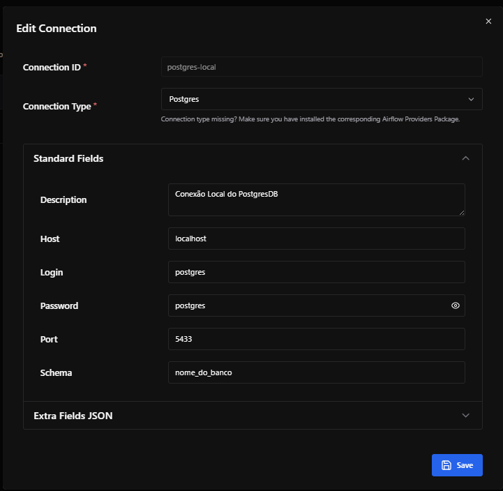

# Desafio Técnico — Pipeline ETL (API -> Data Warehouse)

**Última atualização:** 2025-09-12

## Visão geral
Este repositório contém a solução para o case técnico solicitado: um pipeline ETL que consome uma API paginada, realiza profiling, transforma e valida os dados e carrega em um banco PostgreSQL (rodando em Docker). O pipeline pode ser executado manualmente (scripts Python) ou orquestrado pelo Airflow.

Principais pontos implementados:
- Extração paginada com retries e backoff (tenacity).
- Exploração / profiling para entender schema, nulos e amostras (reports/profile.md).
- Transformações (conversão de datas/números) e validações (nulos críticos, duplicados, formatos).
- Carga em PostgreSQL com estrutura dimensional (dimensões + fato).
- Orquestração com Airflow (DAG `api_etl_case`).
- Infra local com Docker Compose (Postgres + Airflow opcional).

---

## Estrutura do repositório
```
DESAFIO-CASE-TECNICO-MAXINUTRI/
├── dags/                      # DAGs do Airflow
├── data/
│   ├── raw/                   # JSONs brutos das páginas
│   └── processed/             # CSV/Parquet processados
├── docs/
│   └── imgs/                  # imagens e diagramas (ETL flow)
├── reports/                   # perfil e relatórios de validação
├── sql/                       # scripts SQL (schema, helpers)
├── src/
│   └── etl/                   # módulos do ETL (extract/explore/transform/load)
├── .env.example
├── config.yaml
├── docker-compose.yaml
├── requirements.txt
└── README.md
```

---

## Tecnologias utilizadas
- Python 3.10+ — scripts ETL (pandas, requests, sqlalchemy).
- Apache Airflow — orquestração das tasks (DAG).
- PostgreSQL — Data Warehouse (docker container).
- Docker / Docker Compose — ambiente de desenvolvimento local.
- Tenacity — retries com backoff exponencial.
- SQLAlchemy / psycopg2 — conexão e carga no Postgres.

---

## Pré-requisitos
- Docker & Docker Compose (para ambiente com Postgres e Airflow).
- Python 3.10+ (se executar local sem Docker).
- Variáveis de ambiente em arquivo `.env` (copie `.env.example` e ajuste).

### Exemplo `.env`
```
API_URL=https://teste-engenheiro.onrender.com/data
API_TOKEN=TOKEN-TESTE
PG_HOST=localhost
PG_PORT=5433
PG_DB=desafio_db
PG_USER=postgres
PG_PASSWORD=admin@0722
LOG_LEVEL=INFO
```

---

## Arquivo de configuração (`config.yaml`)
O pipeline usa `config.yaml` com referências a variáveis do `.env` no formato `${VAR}`. O utilitário `load_config` (em `src/etl/utils.py`) expande essas variáveis e valida presença, levantando erro claro se algo estiver faltando.

Exemplo:
```yaml
api:
  url: ${API_URL}
  token: ${API_TOKEN}

storage:
  raw_dir: data/raw
  processed_dir: data/processed

db:
  host: ${PG_HOST}
  port: ${PG_PORT}
  database: ${PG_DB}
  user: ${PG_USER}
  password: ${PG_PASSWORD}
  schema: public
  table: fato_pedido
```

---

## Como executar (modo rápido)

### 1) Astronomer (Astro CLI) - (recomendado)
1. Copie `.env.example` -> `.env` e ajuste conforme seu ambiente.
2. Rode:
```bash
winget install -e --id Astronomer.Astro
```

3. Inicie os serviços:
```bash
astro dev init
astro dev start
```

3. Aguarde as configurações iniciais (pode levar alguns minutos).

4. Acesse o Airflow UI:
   - http://localhost:8080
   - Usuário: `admin` / Senha: `admin` (Caso necessite)

5. Importe as conexões/variáveis:
   - Vá em `Admin -> Connections -> Add Connection` e adicione os dados da conexão do banco PostgresSQL.

   

   - OBS: Use o mesmo nome `meu_postgres` para o `conn_id`.

---

## Descrição detalhada das etapas do ETL

### Extract
- Consome a API paginada (`/data?token=...&page=N`).
- Implementa retries exponenciais com `tenacity` (parâmetros: up to 5 tentativas, backoff exponencial com máximo de 60s).
- Persiste cada página como `data/raw/page_N.json` e grava `_meta.json` com informação de paginação e contagens.
- Em caso de erro irreversível (status não 200 após retries), a task falha e o erro é logado com stacktrace.

### Explore / Profiling
- Consolida todos os objetos `dados` das páginas em um DataFrame (pandas).
- Gera `reports/profile.md` contendo: linhas, colunas, nulos por coluna, distinct, e amostras de valores.
- Escreve `data/processed/records.csv` para uso da etapa de transformação.

### Transform
- Lê `data/processed/records.csv` (ou consolida direto dos JSONs se CSV não existir).
- Converte colunas de data (`*_timestamp`, `*_at`, `date*`) para datetime (`pandas.to_datetime` com `errors='coerce'`).
- Converte colunas numéricas (ex.: `price`, `freight_value`, `product_weight_g`, dimensões do produto) para numérico com `pd.to_numeric(..., errors='coerce')`.
- Executa validações sobre os dados (antes do load):
  - Checagem de valores nulos em colunas críticas (`order_id`, `customer_id`, `order_purchase_timestamp`).
  - Checagem de duplicados em `order_id` (ou chave candidata definida).
  - Checagem de datas inválidas (linhas com `NaT` após parsing).
- Se houver problemas de validação, a etapa levanta `ValueError` e salva `reports/validation_report.txt` com detalhes. O pipeline encerra nesse ponto (evita ingestão de dados sujos).

### Load (PostgreSQL)
- Conecta ao Postgres usando SQLAlchemy/psycopg2.
- Cria schema/tabelas (se necessário) e carrega os dados validados em `fato_pedido` (nomeada conforme o case) com `df.to_sql(..., if_exists='replace' ou 'append')` — a estratégia usada no projeto pode ser configurada (full replace para entrega, incremental em produção).
- Opcional: cria/atualiza `dim_tempo` a partir da primeira coluna de data encontrada (upsert simples).

---

## Tratamento de erros & Logs
- Retries/backoff: extração usa `tenacity` para proteger contra falhas temporárias da API. Logs mostram tentativas e backoff aplicados.
- Validações explícitas: transform valida e interrompe o pipeline com relatório em `reports/validation_report.txt` sempre que encontra problemas críticos.
- Logs: recomenda-se usar `logging` do Python com configuração por variável `LOG_LEVEL`. Logs por padrão podem ser configurados para gravar em `logs/etl.log`. No Airflow, cada task possui sua própria saída de log no UI e discos montados.
- Erro no Airflow: qualquer exceção não capturada faz a task falhar e o Airflow registra o traceback completo. Use retries do Airflow (configuráveis no DAG) para falhas transitórias também.

---

## Schema do Data Warehouse (exemplo baseado no projeto)
A imagem do banco está em `docs/imgs/schema_visual_db.png` (fornecida) e o diagrama ETL está em `docs/imgs/etl_flow.png` (gerado). Tabelas principais esperadas no DW:

- dim_cliente (cliente_id, nome, cidade, estado, zip_prefix, ...)
- dim_produto (product_id, nome_categoria, peso_g, comprimento_cm, altura_cm, largura_cm, ...)
- dim_avaliacao (review_id, review_score, comment, created_at, answered_at, ...)
- dim_tempo (date_key, year, month, day, weekday)
- fato_pedido (order_id, customer_id -> dim_cliente, product_id -> dim_produto, order_status, price, freight_value, order_purchase_timestamp -> dim_tempo_key, ...)

Exemplo simples de criação (em `sql/schema.sql`):
```sql
CREATE TABLE IF NOT EXISTS public.dim_cliente (
  customer_id TEXT PRIMARY KEY,
  customer_city TEXT,
  customer_state TEXT,
  customer_zip_code_prefix INT
);

CREATE TABLE IF NOT EXISTS public.dim_produto (
  product_id TEXT PRIMARY KEY,
  product_category_name TEXT,
  product_weight_g INT,
  product_length_cm INT,
  product_height_cm INT,
  product_width_cm INT
);

CREATE TABLE IF NOT EXISTS public.dim_tempo (
  date_key DATE PRIMARY KEY,
  year INT,
  month INT,
  day INT,
  weekday INT
);

CREATE TABLE IF NOT EXISTS public.fato_pedido (
  order_id TEXT PRIMARY KEY,
  customer_id TEXT,
  product_id TEXT,
  order_status TEXT,
  order_purchase_timestamp TIMESTAMP,
  price NUMERIC,
  freight_value NUMERIC
);
```

---

## Observabilidade e testes
- Relatórios: `reports/profile.md` (profiling inicial) e `reports/validation_report.txt` (falhas de validação).
- Testes unitários: recomenda-se adicionar testes para as funções de parsing/validação (ex.: `tests/etl/test_transform.py`).
- Checks: contagens por etapa (raw rows vs loaded rows) e checksums podem ser adicionados a uma tabela de metadata para auditoria.

---

## Diagrama do processo ETL
Abaixo está um diagrama mermaid (também há uma imagem em `docs/imgs/etl_flow.png`):

```mermaid
flowchart LR
  A[API Remota (paginada)] --> B[Extract (retries + backoff)]
  B --> C[Data Lake raw (JSON)]
  C --> D[Explore / Profiling]
  D --> E[Transform (conversões)]
  E --> V[Validations (nulos, duplicados, formatos)]
  V --> L[Load -> PostgreSQL (dim_*, fato_pedido)]
  L --> BI[BI / Relatórios]
```

---

## Próximos passos / melhorias sugeridas
- Implementar incremental loads (idade do dado, watermark, upsert por chave natural).
- Testes de dados com Great Expectations ou dbt tests.
- Particionamento por data nas tabelas fato (melhora performance e manutenção).
- Monitoramento e alertas (Prometheus/Grafana ou alertas por e-mail no Airflow).
- Modelagem estrela final conforme domínio (separar fatos por evento e relacionamentos).

---

## Contato
Qualquer ajuste que precisar eu posso ajudar a implementar: logs adicionais, testes, evolução do modelo dimensional ou integração com ferramentas BI.

---
